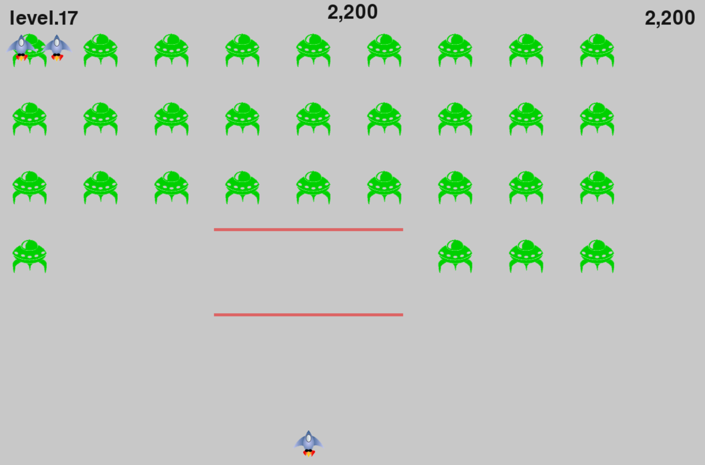
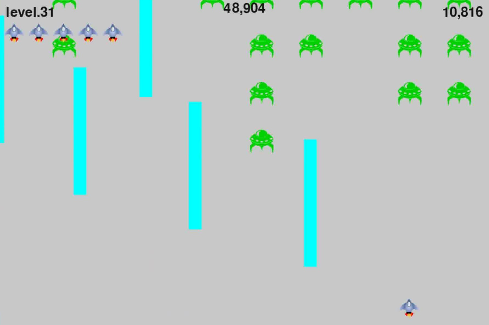
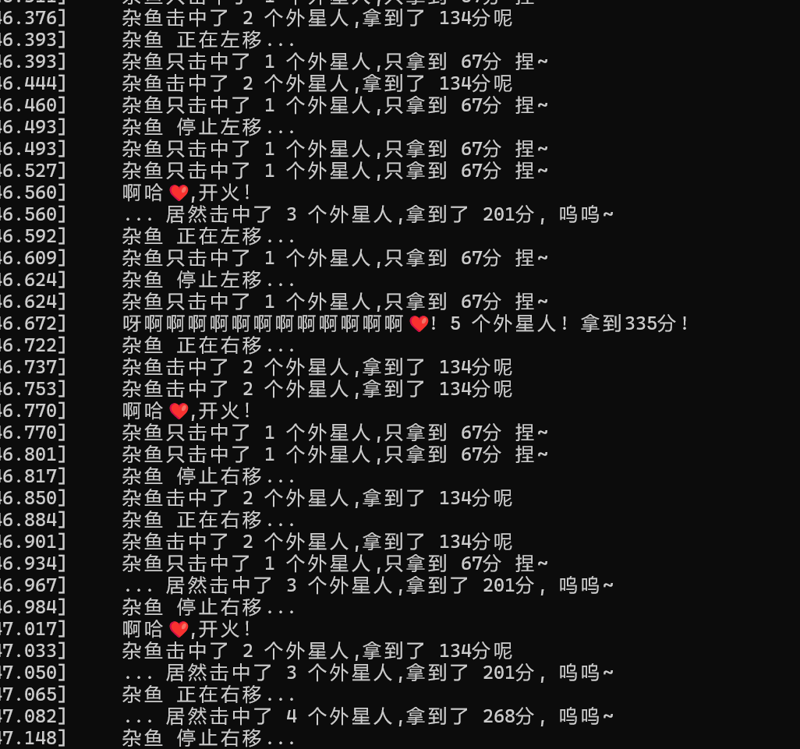

# 外星人入侵
Modified version based on "Alien Invasion" from "Python Crash Course (3rd Edition)"

- 考验手速<!-- 打到30+就是纯刷分了 -->
- 支持左右移动,空格射击,q键退出(英文输入法下)
- 有三种武器会分别在Level.1-10,11-20,21-...中使用
- 雌小鬼版日志打印
- 发行版分辨率固定为1200x800,可在setting.py中修改分辨率大小(这将直接影响游戏难度)
<!-- setting.py中chek_SuperFire的superfire可修改为True -->

### 游戏截图

  
  
  
波武器&emsp;&emsp;&emsp;&emsp;&emsp;&emsp;&emsp;&emsp;&emsp;&emsp;&emsp;&emsp;&emsp;&emsp;&emsp;&emsp;&emsp;&emsp;&emsp;&emsp;&emsp;&emsp;顶级激光武器

  
  
记录输出

  

**感谢游玩！**
    &emsp;
